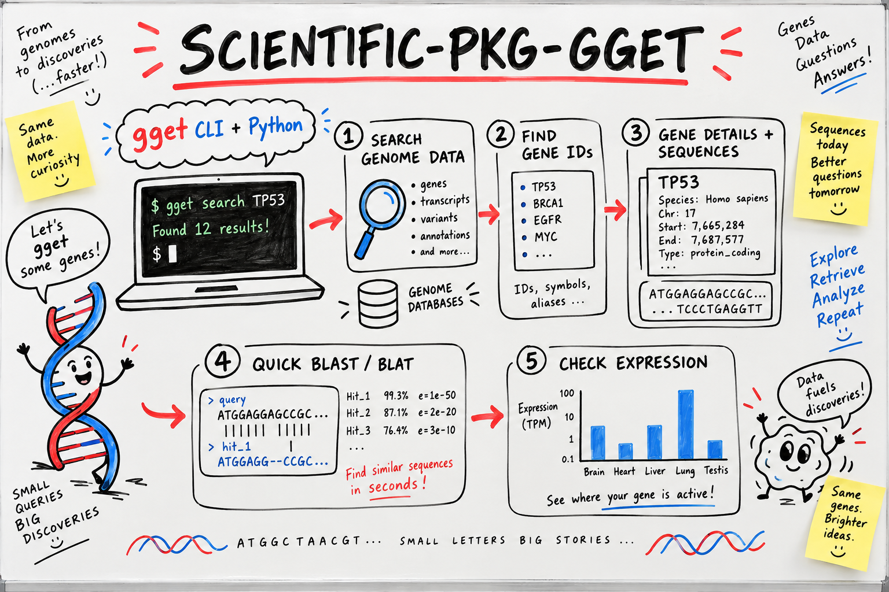

# genome-search-plus



   

> **Built on [affaan-m/ECC](https://github.com/affaan-m/ECC)** by @affaan-m (262,145 stars, MIT). All credit for the original idea to them. This fork improves and repackages it; upstream license preserved in [UPSTREAM_LICENSE](UPSTREAM_LICENSE).

**A Claude Code skill for safe genome search, gene lookup, sequence fetch, and clear query logs with gget.**

## 🧬 Why

Genome tools can return the wrong gene, species, ID, or build.

Flags and output types can also change between releases.

This skill helps developers and researchers use `gget` with simple checks. It tells Claude Code to read current help, test small queries, save results, and never guess missing facts.

It plugs into your normal Claude Code flow as one small skill file.

## ⚡ Install

```bash
mkdir -p ~/.claude/skills/scientific-pkg-gget && curl -fsSL https://raw.githubusercontent.com/genome-search-plus/genome-search-plus/main/skill/SKILL.md -o ~/.claude/skills/scientific-pkg-gget/SKILL.md
```

## 🔎 Usage

Ask Claude Code:

```text
Use the gget skill to find the human BRCA1 gene, check its details,
fetch its sequence, and save a work log. Do not replace old files.
```

Claude Code will guide a checked flow like this:

```bash
gget --version
gget search --help
gget search -s human brca1 -o brca1-search.json

gget info --help
gget info ENSG00000012048 -o brca1-info.json

gget seq --help
gget seq ENSG00000012048 -o brca1-seq.fa
```

Expected output:

- A search result file with human BRCA1 matches.
- A details file for `ENSG00000012048`.
- A FASTA sequence file that is not empty.
- A work log with the date, commands, version, IDs, and errors.
- A check that the species and gene name match the request.

The skill treats all results as database output, not medical advice. It also warns before remote services receive private or patient data.

## 🛠️ What we changed vs upstream

- Rewritten from Japanese into clearer, simpler English with shorter sections and plainer descriptions.
- Expands the “use another tool” guidance with explicit limits for clinical use, fixed releases, local indexes, genome-build control, and high-volume queries.
- Adds stronger operational safeguards: never guess flags, avoid overwriting old results, verify species/gene matches, and treat outputs as non-medical database results.
- Adds a complete BRCA1 walkthrough plus practical validation checks for IDs, gene names, sequence files, and work logs.
- Adds troubleshooting for empty, overly broad, and old/versioned-ID results, while retaining the core modules and CLI/Python examples.

## 📄 License

MIT licensed. The upstream MIT license and credit are preserved in [UPSTREAM_LICENSE](UPSTREAM_LICENSE).